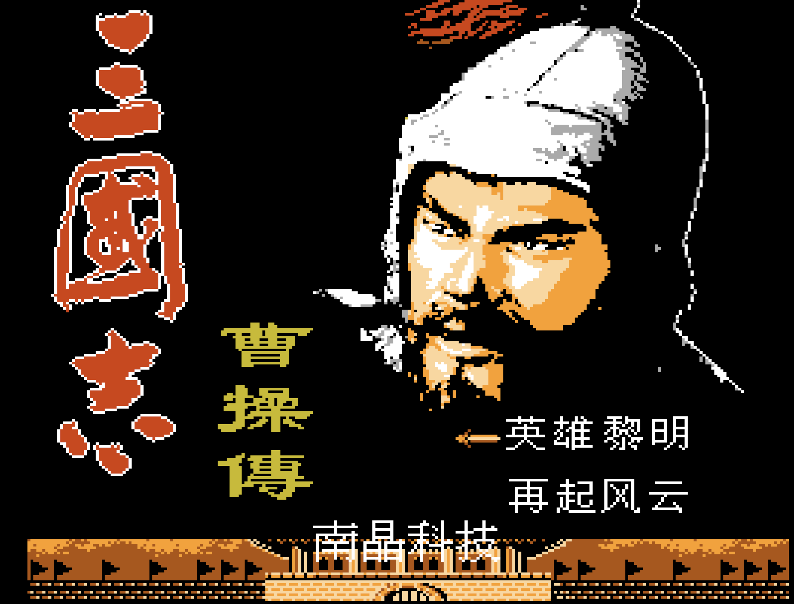

# 三國曹操傳 Save State Editor
FC 南晶版 · OpenEmu Nestopia · Browser-based Save Editor

  <a href="#chinese">中文</a> |
  <a href="#english">English</a>

<strong>中文</strong>

### 簡介
這個專案是給 **三國志曹操傳（FC 南晶版）** 使用的 OpenEmu Nestopia `State` 存檔編輯器。  
你可以直接在瀏覽器中修改主要數值（金錢、復活草、兵力），並下載修正後的 `State` 檔案。

### 使用方式
1. 在 Finder 對 `.oesavestate` 檔案按右鍵，選擇 **Show Package Contents（顯示套件內容）**。
2. 找到 `State` 檔（不是 `Info.plist` 或 `ScreenShot`）。
3. 用瀏覽器開啟 `index.html`。
4. 將 `State` 檔拖曳進編輯器。
5. 修改數值後按 **Save & Download**。
6. 用下載後的新檔案取代套件中的原始 `State`。
7. 回到 OpenEmu 重新載入該存檔。

編輯前請務必先備份原始存檔。

<strong>English</strong>

### Intro
This project is a browser-based editor for OpenEmu Nestopia `State` files of **Three Kingdoms: Cao Cao** (三国志曹操传).  
You can edit key values (gold, revive grass, troops) locally in your browser and download a patched `State` file.

### How to Use
1. In Finder, right-click your `.oesavestate` file and choose **Show Package Contents**.
2. Find the `State` file (not `Info.plist` or `ScreenShot`).
3. Open `index.html` in your browser.
4. Drag and drop the `State` file into the editor.
5. Edit values, then click **Save & Download**.
6. Replace the original `State` file in the save bundle.
7. Reload the save state in OpenEmu.

Always keep a backup before editing.

## Developer Docs
Detailed technical notes, file format mapping, project structure, and testing instructions are in [DEVELOPER_WIKI.md](./DEVELOPER_WIKI.md).
