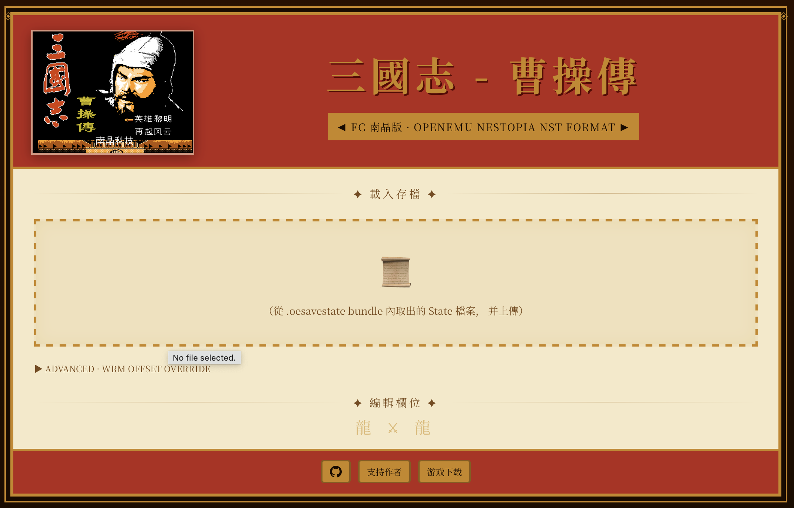

# FC 三國志-曹操傳 存档编辑器
FC 南晶版 · OpenEmu Nestopia

### 簡介
适用于 **OpenEmu 三國志曹操傳（FC 南晶版)** 的存檔編輯器。  

### 使用方式
1. 在 Finder 對 `.oesavestate` 檔案按右鍵，選擇 **Show Package Contents（顯示套件內容）**。
2. 找到 `State` 檔（不是 `Info.plist` 或 `ScreenShot`）。
3. 用瀏覽器開啟 `index.html`。
4. 將 `State` 檔拖曳進編輯器。
5. 修改數值後按 **Save & Download**。
6. 用下載後的新檔案取代套件中的原始 `State`。
7. 回到 OpenEmu 重新載入該存檔。

💡 編輯前請務必先備份原始存檔。

## 支持作者，再添新品

  
  

#### 开发手册
- [DEVELOPER_WIKI.md](./DEVELOPER_WIKI.md).

#### 还没有安装游戏?

- [下载 OpenEmu](https://openemu.org)
- [下载 三国志-曹操传](https://mega.nz/file/fZ9GSIZA#Mh9OpDLmodokUXo9vey1Y_q5XHaz2P3XXvBeCxkA8CI)
